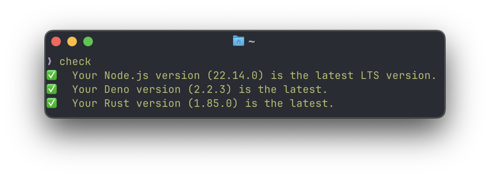

# @bob/check [](https://jsr.io/@bob/check)

A tool to check if your Node.js, Deno, and Rust versions are up to date.



## Installation

Run the following command to install:

```bash
deno install -g -A jsr:@bob/check
```

> `-g` flag is used to install the tool globally.
> `-A` flag is used to grant all permissions to the tool.

## Usage

Run the tool:

```bash
check
```

## Uninstall

Run the following command to uninstall:

```bash
deno uninstall -g check
```

## License

[MIT](./LICENSE) Copyright © 2025-PRESENT [Bob Zheng](https://github.com/bobz25)
